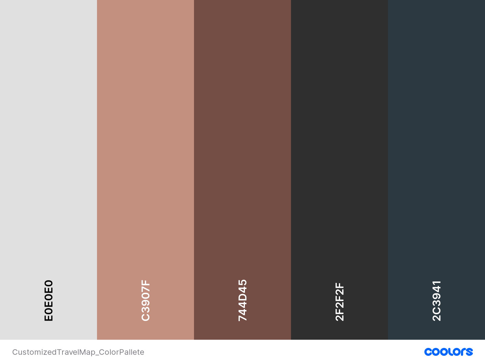
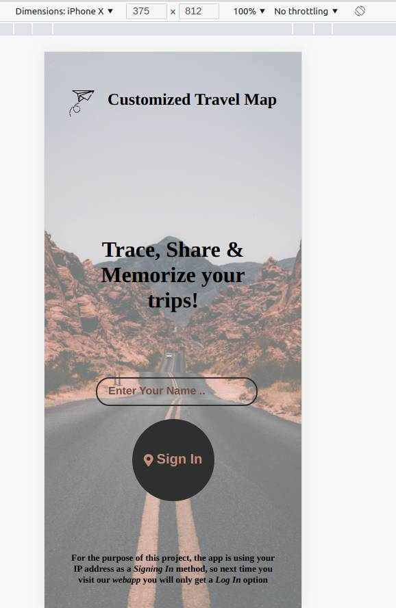

# CustomizedTravelMap

>This project demonstrate the knowledge we gain in the first four modules of HYF (HTML/CSS, JavaScript, Browsers, & API's).

## The General Idea

Build a **_Mobile-First_** Website where the user can create a **Travel Log** of their **Trips**.

## Design Inspiration

## Demo

## How To Use

The Website was only styled to work on **Mobile View**, therefore, please use the **_Toggle device toolbar_** and choose _iPhoneX_ as Dimensions.

>You can access the **_Toggle device toolbar_** through _Ctrl+Shift+I_ on Chrome.

## The Folder Structure

- media
>contains all the images used in the project 
- public
>contains the style.css file
- src
    1. mapInit.js
    >The only JavaScript file included in the index.html
    2. DOMUtils.js
    >contains reusable functions
    3. calculateDistance.js
    >JavaScript program to calculate Distance Between Two Points on Earth
    4. mapHandler.js
    >contains the functions that will run after addEventListener
    5. mapListener.js
    >redirecting and combining multi-addEventListener
    6. APIs
     >contains the API logic
     - ipInfoAPI.js
     - positionStackAPI.js
    7. views 
    >contains the DOM creation of the HTML
    - signInPageViews.js
    - profileViews.js
    - tripTabViews.js
    - formViews.js
    - locationCardViews.js
    - figuresTabViews.js
    - mapTabViews.js

## The Must Have

- When user visit the site for the first time, the app will his IP in addition to his Location & Region.
>This will be achieved through ipinfo API.
- The user must be able to Input a Location.
- The user must be able to enter the Start Date & End Date of the entered location.
- The user must be able to get an option to add that location to their Travel List.
- The user must be able to see some Figures like; the number of visited countries,
the covered percentage of the world, the number of visited locations &
the amount of crossed distance in KM.
- The user must be able to see a country bar that shows all the countries they visited.
- The user must be able to get a separate log with the locations they visited in each county.
>This is being achieved by using the positionstack API.
- The user must be able to create a Location Card for each visited location.

## The Nice to Have

- The user can create a personal profile by adding a Cover & Profile Photo.
- The user can create a Location Card where they can add a Header Photo.
- The user can have Four Buttons associated with the Location Card;
Duplicate, Remove, View & Edit.
- The user can view their Location Cards as List or Grid View.
- The user can see a customized map that shows all the Visited Countries & Locations.
- The user can Zoom in & out.
- The user can use a Search Bar to see a specific location on the map.
>Here we might need to use Google Map API.